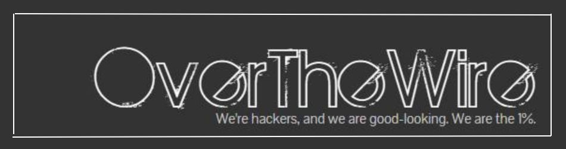

> [CTF's Write-Ups](../README.md)

 

  

 

> 
  English - ENG  | <a href=https://github.com/frandausmeier/CTF_Write-Ups/blob/main/OverTheWire/README.es.md> Spanish - SPA<a/>. 

-----

 

    
 These are the write-ups, reports and additional notes I've compiled in the realisation of the OverTheWire war games. 

 

-----

 

- [Bandit [1].](https://github.com/frandausmeier/CTF_Write-Ups/blob/main/OverTheWire/Bandit/README.md)

 

---

 

<!-- - [Krypton [2].](https://github.com/frandausmeier/CTF_Write-Ups/blob/main/OverTheWire/Krypton/README.md) -->

 

