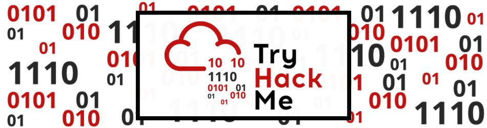

  

 

> 
  Español - ESP  | <a href=https://github.com/frandausmeier/CTF_Write-Ups/blob/main/TryHackMe/README.md> Inglés - ING<a/>. 

-----

 

Estos son los _write-ups_, reportes y algunas notas adicionales que guardé de la realización de los _wargames_ de [TryHackMe](https://tryhackme.com/challenges).

 

---

 

- [5 minute hacks](https://github.com/frandausmeier/CTF_Write-Ups/blob/main/TryHackMe/5_minute_hacks/README.es.md).

 

- [Challenges Faciles](https://github.com/frandausmeier/CTF_Write-Ups/blob/main/TryHackMe/Easy_Challenges/README.es.md).

 

- Challengesde nivel medio.

 

---

